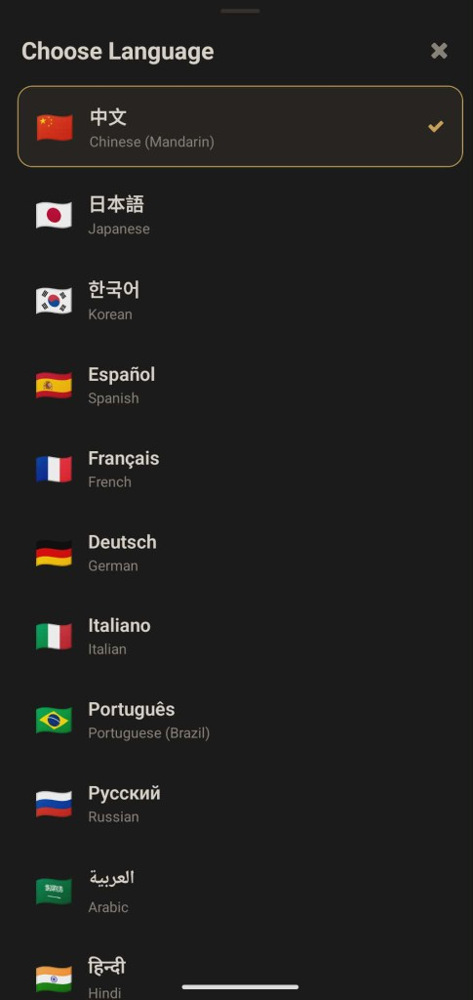
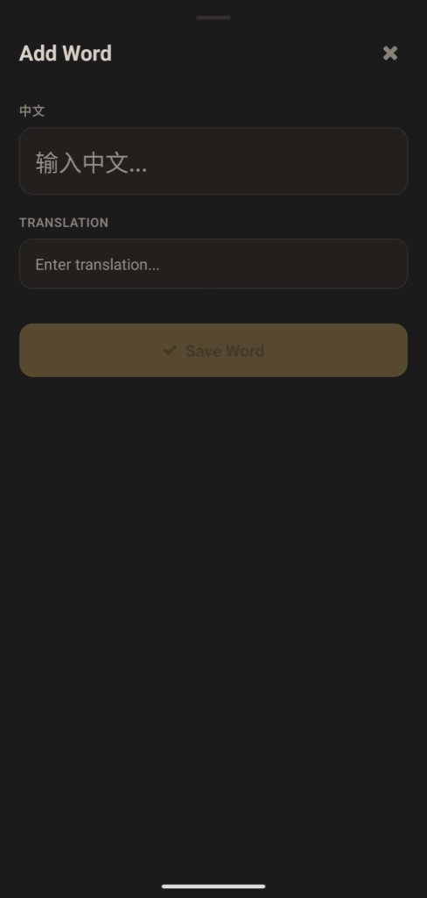
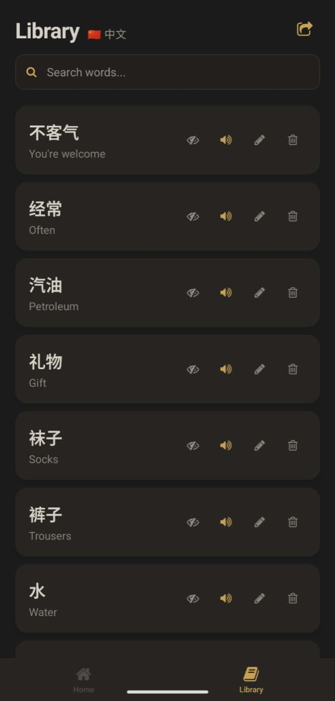
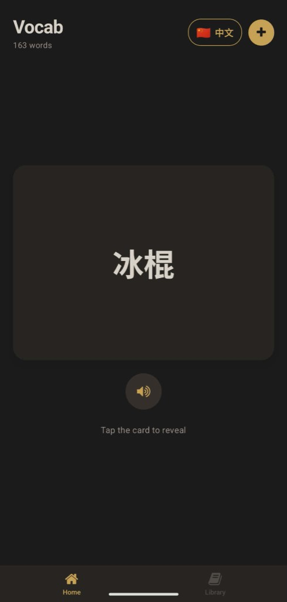
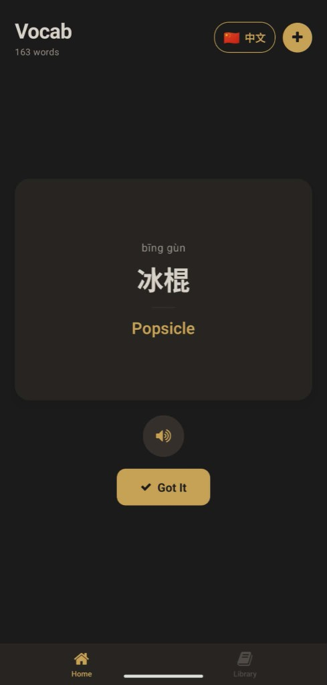

# WordHoard

A personal vocabulary collector for language learners. Add words, build your library, and quiz yourself with flashcards -- all offline, no account needed.

Supports **16 languages** with text-to-speech pronunciation and automatic romanization for non-Latin scripts.

[**Download APK (Android)**](https://github.com/maxchalabi/wordhoard/releases/latest/download/WordHoard-v1.0.1.apk)

Open the link above on your Android phone, download the APK, and tap to install. You may need to allow "Install from unknown sources" when prompted. No Expo, no server -- it runs as a standalone app.

## How It Works

<table>
  <tr>
    <td align="center" width="200">
      <br />
      <b>Pick your language</b><br />
      <sub>Choose from 16 languages. Non-Latin scripts get automatic pronunciation guides.</sub>
    </td>
    <td align="center" width="200">
      <br />
      <b>Add words as you learn</b><br />
      <sub>Type a word and its translation. Pinyin, romaji, and other romanizations are generated automatically.</sub>
    </td>
    <td align="center" width="200">
      <br />
      <b>Browse your library</b><br />
      <sub>Search, edit, listen to pronunciation, or export your full word list.</sub>
    </td>
  </tr>
  <tr>
    <td align="center" width="200">
      <br />
      <b>Quiz yourself</b><br />
      <sub>A random word appears as a flashcard. Less-reviewed words come up more often.</sub>
    </td>
    <td align="center" width="200">
      <br />
      <b>Tap to reveal</b><br />
      <sub>Flip the card to see the translation, pronunciation, and hear it spoken aloud.</sub>
    </td>
    <td></td>
  </tr>
</table>

## Supported Languages

| Language | Script | Pronunciation Guide |
|----------|--------|-------------------|
| 🇨🇳 Chinese (Mandarin) | Hanzi | Pinyin |
| 🇯🇵 Japanese | Kana/Kanji | Romaji |
| 🇰🇷 Korean | Hangul | Romanization |
| 🇷🇺 Russian | Cyrillic | Transliteration |
| 🇸🇦 Arabic | Arabic | Transliteration |
| 🇮🇳 Hindi | Devanagari | Transliteration |
| 🇹🇭 Thai | Thai | Transliteration |
| 🇪🇸 Spanish | Latin | -- |
| 🇫🇷 French | Latin | -- |
| 🇩🇪 German | Latin | -- |
| 🇮🇹 Italian | Latin | -- |
| 🇧🇷 Portuguese (Brazil) | Latin | -- |
| 🇻🇳 Vietnamese | Latin | -- |
| 🇹🇷 Turkish | Latin | -- |
| 🇮🇩 Indonesian | Latin | -- |
| 🇺🇸 English | Latin | -- |

## Features

- **Flashcard quiz** with weighted random selection -- less-reviewed words show up more often
- **Text-to-speech** with per-language voice and speech rate
- **Auto-romanization** for non-Latin scripts (pinyin, romaji, transliteration)
- **Per-language library** with search, edit, and delete
- **Export** your word list as a text file via the native share sheet
- **Fully offline** -- no server, no accounts, all data stored locally
- **Dark theme** with warm gold accents

## Tech Stack

- React Native + Expo SDK 54
- expo-router v6 (file-based routing)
- AsyncStorage (per-language local storage)
- expo-speech (native TTS)
- expo-file-system + expo-sharing (export)
- pinyin-pro (Chinese), wanakana (Japanese), built-in tables (Korean, Russian, Arabic, Hindi, Thai)

## Getting Started

### Prerequisites

- [Node.js](https://nodejs.org/) (v18+)
- [Expo CLI](https://docs.expo.dev/get-started/installation/)

### Install

```bash
git clone https://github.com/maxchalabi/wordhoard.git
cd WordHoard
npm install
```

### Run in browser

```bash
npx expo start --web
```

### Run on your phone (dev)

Install [Expo Go](https://expo.dev/go), then:

```bash
npx expo start
```

Scan the QR code with Expo Go.

### Build a standalone APK

The app is linked to Expo via `extra.eas.projectId` in `app.json`. If you ever need to re-link, use the `eas init --id …` command from your Expo project page.

```bash
npm install -g eas-cli
eas login
eas build -p android --profile preview
```

**Do not** use the dashboard’s `build --platform all --auto-submit` unless you are ready to submit to the Play Store and App Store; for a phone install, the command above produces a downloadable `.apk`.

Download the `.apk` from the link EAS gives you and install it on your phone.

## Compatibility

Tested on **Google Pixel**. Should work on any Android device running Android 6.0+ (API 23+).

The app uses the device's native text-to-speech engine for pronunciation. **Google Pixel** and most devices with Google Play Services come with Google TTS preinstalled, which has good voice coverage across all 16 supported languages. **Samsung** devices ship with Samsung TTS, which may need the [Google TTS engine](https://play.google.com/store/apps/details?id=com.google.android.tts) installed for best results with less common languages.

If a language's voice sounds robotic or is missing, go to **Settings > System > Languages > Text-to-Speech** and download the voice pack for that language.

## Project Structure

```
app/
  _layout.tsx           Root layout (dark theme, stack navigator, data migration)
  add-modal.tsx         Add Word modal
  language-modal.tsx    Language selector (16 languages)
  (tabs)/
    _layout.tsx         Bottom tabs: Home, Library
    index.tsx           Home -- language picker, flashcard quiz, add button
    library.tsx         Library -- search, word list, edit, export
lib/
  languages.ts          Language configs (16 languages)
  database.ts           AsyncStorage CRUD, migration
  speech.ts             TTS wrapper
  pronunciation.ts      Multi-language romanization
components/
  WordForm.tsx           Shared add/edit form
  WordCard.tsx           Word display card
  FlashCard.tsx          Flippable quiz card
  useColors.ts           Theme color hook
  useLanguage.ts         Selected language hook
```

## License

MIT
